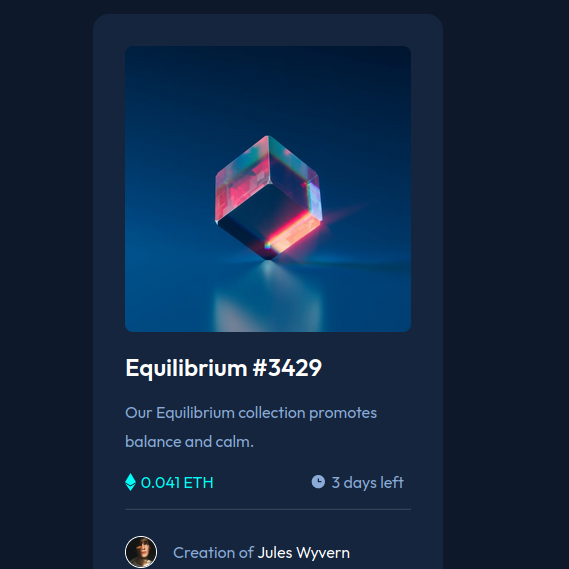

# Frontend Mentor - NFT preview card component solution

This is a solution to the [NFT preview card component challenge on Frontend Mentor](https://www.frontendmentor.io/challenges/nft-preview-card-component-SbdUL_w0U). Frontend Mentor challenges help you improve your coding skills by building realistic projects.

### The challenge

Users should be able to:

- View the optimal layout depending on their device's screen size
- See hover states for interactive elements

### Screenshot

### Links

- Solution URL: (https://github.com/Anubhav-Ray/NFT-Preview-Card-Component/tree/master)
- Live Site URL: (https://anubhav-ray.github.io/NFT-Preview-Card-Component/)

### Built with

- Semantic HTML5 markup
- CSS custom properties
- Flexbox
- Mobile-first workflow

### Continued development

I am looking forward to refining my skills in responsive design.

### Useful resources

- [Mdn WebDocs](https://developer.mozilla.org/en-US/) - Helped me with basic properties of Css
- [Css Tricks](https://css-tricks.com/) - Helped me with flexbox

## Author

Frontend Mentor - [@Anubhav-Ray](https://www.frontendmentor.io/profile/Anubhav-Ray)

## Acknowledgments

Thanks to Google for helping me to find solution whenever I got stuck.
